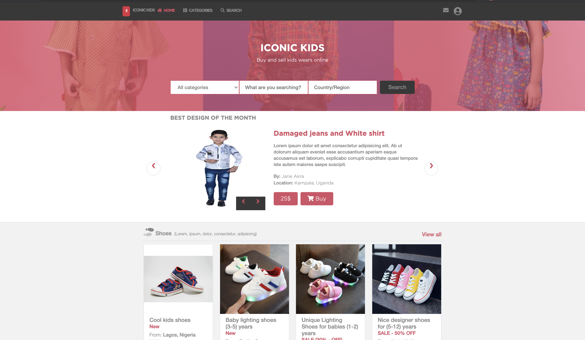

# Online shop (index and search page) - Built time 17 hours

> This is a capstone/exam project for the [Microverse](https://www.microverse.org) module HTML/CSS. It is a Kids Wear website using HTML, CSS3/SCSS, Bootstrap, and Font awesome.

## Watch a video presentation of the project [here](https://www.loom.com/share/1ecb819a678e4b3f8681da87415597cf). The website is built using this [mockup](https://www.behance.net/gallery/24796463/ZATTIX)

## Screenshot of the index page



## Screenshot of the search page


The project is built using HTML and CSS/SCSS with an extensive use of the grid and flex propreties. I used all SCSS core functionality: variables, mixins and color functions.

## Built With

- HTML
- CSS3/SCSS
- Bootstrap
- Font awesome icons
- Webhint/Stylelint linters
- NPM scripts for testing and running the SCSS changes


## Live Demo

[Live Demo Link](https://okusarobert.github.io/iconickids-shop/)


(You can also navigate between pages using the navigation links and the search form.)

## To get a local copy up and running follow these simple example steps.

### Setup

Clone the project locally.

### Run tests
Run ``` npx html-validator-cli --quiet --file index.html ``` to run the validator over the ```index.html``` file.

The ```--quiet``` will only list ```errors```. If you also want to see the warnings use the ```--verbose``` flag instead.
As an alternative, you can also install the ```html5validator``` using ```pip```:

``` 
pip install --user html5validator
html5validator index.html
```

### Deployment

Install and run a live server plugin on you IDE/Text editor and run it from the root directory.

### Future improvements

Add a backend to the page

## Authors

👤 **Okusa John Robert**

- Email: [okusarobert@gmail.com](okusarobert@gmail.com)
- Github: [https://github.com/okusarobert](https://github.com/okusarobert)
- Twitter: [https://twitter.com/okusarobert](https://twitter.com/OkusaJ)

## Show your support

Give a ⭐️ if you like this project!

## 📝 License

This project is [MIT](lic.url) licensed.